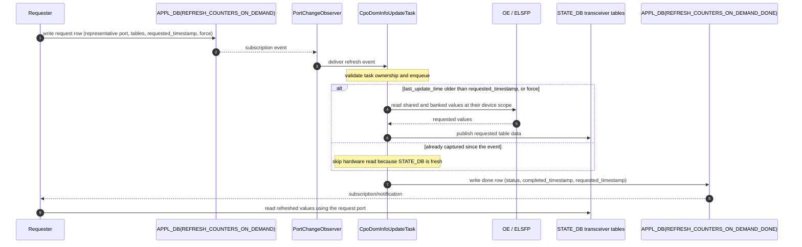

# On-Demand Transceiver STATE_DB Refresh in xcvrd for CPO

High Level Design

Rev. 1.0

## Table of Contents

- [On-Demand Transceiver STATE\_DB Refresh in xcvrd for CPO](#on-demand-transceiver-state_db-refresh-in-xcvrd-for-cpo)
  - [Table of Contents](#table-of-contents)
  - [0 General](#0-general)
    - [0.1 Revision](#01-revision)
    - [0.2 Scope](#02-scope)
    - [0.3 Definitions/Abbreviations](#03-definitionsabbreviations)
    - [0.4 Overview](#04-overview)
    - [0.5 Use case](#05-use-case)
  - [1 Requirements](#1-requirements)
    - [1.1 Architecture Design](#11-architecture-design)
    - [1.2 Functional Requirements](#12-functional-requirements)
    - [1.3 Configuration and Management Requirements](#13-configuration-and-management-requirements)
    - [1.4 Scalability Requirements](#14-scalability-requirements)
    - [1.5 Performance Requirements](#15-performance-requirements)
    - [1.6 Warm/Fast boot Requirements](#16-warmfast-boot-requirements)
    - [1.7 Multi ASIC Requirements](#17-multi-asic-requirements)
  - [2 Design](#2-design)
    - [2.1 Background](#21-background)
    - [2.2 Motivation](#22-motivation)
    - [2.3 Flows diagram](#23-flows-diagram)
      - [End-to-end flow](#end-to-end-flow)
      - [Event-ordering guard](#event-ordering-guard)
    - [2.4 SAI API](#24-sai-api)
    - [2.5 Platform API](#25-platform-api)
    - [2.6 Lower Layer API](#26-lower-layer-api)
    - [2.7 Counters](#27-counters)
    - [2.8 Error handling](#28-error-handling)
    - [2.9 Event logging](#29-event-logging)
    - [2.10 Configuration and Mangement](#210-configuration-and-mangement)
      - [2.10.1 Manifest (if the feature is an Application Extension)](#2101-manifest-if-the-feature-is-an-application-extension)
      - [2.10.2 YANG Model](#2102-yang-model)
      - [2.10.3 CLI](#2103-cli)
        - [2.10.3.1 Command Structure](#21031-command-structure)
        - [2.10.3.2 Usage Examples](#21032-usage-examples)
      - [2.10.4 gNMI](#2104-gnmi)
    - [2.11 DB Schema](#211-db-schema)
      - [2.11.1 Data Sample](#2111-data-sample)
      - [Request row](#request-row)
      - [Done row](#done-row)
    - [2.12 Memory Consumption](#212-memory-consumption)
    - [2.13 Restrictions/Limitations](#213-restrictionslimitations)
      - [Restrictions](#restrictions)
      - [Limitations](#limitations)
  - [3 Test Plan](#3-test-plan)
    - [3.1 Quality Guarantee](#31-quality-guarantee)
    - [3.2 Unit tests](#32-unit-tests)
  - [4 Security](#4-security)
    - [4.1 New API](#41-new-api)
    - [4.2 New resources required](#42-new-resources-required)
    - [4.3 Secrets](#43-secrets)
    - [4.4 New 3rd party resources](#44-new-3rd-party-resources)
  - [Reference table](#reference-table)

## 0 General

### 0.1 Revision

Table 1 Revision

| Rev | Date | Author | Change Description |
| --- | --- | --- | --- |
| 1.0 | 2026-07-28 | Natanel Gerbi | Base version |

### 0.2 Scope

This document defines an on-demand refresh mechanism in `xcvrd` that lets SONiC components to request a targeted re-read of selected transceiver STATE_DB tables for a port, without disrupting periodic polling.

### 0.3 Definitions/Abbreviations

| Term | Definition |
| --- | --- |
| xcvrd | Transceiver daemon in the pmon container |
| CPO | Co-Packaged Optics |
| OE | Optical Engine |
| ELSFP | External Laser Source |
| DOM | Digital Optical Monitoring |
| COR | Clear-on-Read field — cleared by hardware upon being read |
| CMIS | Common Management Interface Specification |
| APPL_DB | Redis application database |
| STATE_DB | Redis state database |
| Requester | Any local SONiC component that writes to the request table |
| Representative port | The first logical port mapped to the same physical port index |


### 0.4 Overview

`CpoDomInfoUpdateTask` collects telemetry from CPO OE's and ELS's and publishes the data under their corresponding logical ports in STATE_DB. Today, this collection runs periodically, so a component reacting to an event such as a fault indication must wait for the next polling cycle to obtain updated data.

### 0.5 Use case

A component that receives an asynchronous transceiver fault indication needs fresh diagnostic data immediately, without waiting for the next periodic poll.

## 1 Requirements

### 1.1 Architecture Design

### 1.2 Functional Requirements

1. A local SONiC component shall be able to request an immediate refresh of selected OE and ELS STATE_DB tables for specific port.
2. `CpoDomInfoUpdateTask` shall validate and process the request using existing `PortChangeObserver`, then report completion or failure through APPL_DB.
3. The requester shall use the representative logical port as the request key. A non-representative logical port, or an invalid port, shall be rejected with `ERROR:INVALID_PORT`.

### 1.3 Configuration and Management Requirements

### 1.4 Scalability Requirements

### 1.5 Performance Requirements

### 1.6 Warm/Fast boot Requirements

### 1.7 Multi ASIC Requirements

## 2 Design

### 2.1 Background

`CpoDomInfoUpdateTask` is the `xcvrd` worker that collects diagnostics for CPO vmodules, alongside `DomInfoUpdateTask` which handles pluggable transceivers.
On a periodic cycle it reads the sensors, status and fault flags of each OE and ELSFP, and publishes them in the OE and ELS `TRANSCEIVER_*` tables under the logical ports that use each device.

### 2.2 Motivation

The motivation is to let a component refresh a table immediately instead of waiting for the periodic cycle to come around. For example, when a fault indication arrives, the component handling it needs the fault data right away; today it has to wait for the next poll, and until then STATE_DB still holds values collected before the event.

The refresh is performed by `CpoDomInfoUpdateTask` rather than by the component, so `xcvrd` stays the only reader of the hardware: some fault fields are clear-on-read, and a second reader would consume flags that `xcvrd` is expected to publish.

### 2.3 Flows diagram

#### End-to-end flow

For one request:



*Data that belongs to a shared OE or ELSFP is read once and published to every port using that device; data that belongs to a single port is read per port. Each request gets its own done row.

#### Event-ordering guard

A refresh may arrive for a table that periodic polling has just read. Reading the device again is wasted work, and for a clear-on-read field it would consume a flag that STATE_DB already reports.

So for each requested table, the task compares the request against that table's row for the requested port:

- `requested_timestamp` earlier than `last_update_time`: the row already covers the event, so the read is skipped.
- Otherwise: the device is read and the row is republished.

Equal timestamps fall into the second case, because with one-second granularity there is no way to tell which came first.
When `force=true` is set, the device is read anyway, regardless of the comparison.

### 2.4 SAI API

No SAI change.

### 2.5 Platform API

No new platform API is introduced. The design uses the existing port mapping and OE/ELSFP sharing information required by `CpoDomInfoUpdateTask`.

### 2.6 Lower Layer API

### 2.7 Counters

### 2.8 Error handling

`CpoDomInfoUpdateTask` reports the outcome in the `status` field of `REFRESH_COUNTERS_ON_DEMAND_DONE` and logs the details. The requester matches the response by `requested_timestamp`.

| `status` | Meaning |
| --- | --- |
| `OK` | Every requested table was refreshed, or safely skipped by the event-ordering guard |
| `PARTIAL` | At least one requested table was unknown and skipped; the remaining tables succeeded |
| `ERROR:<reason>` | The request could not be serviced; no refreshed data is guaranteed |

Defined reasons:

| Reason | Cause |
| --- | --- |
| `MALFORMED_REQUEST` | A required field is missing, `requested_timestamp` cannot be parsed, or no requested table is supported |
| `INVALID_PORT` | The key is not a representative logical port owned by `CpoDomInfoUpdateTask` |
| `DEVICE_ABSENT` | The OE or ELSFP is not present |
| `READ_FAILED` | A refresh of a supported table failed |

### 2.9 Event logging

### 2.10 Configuration and Mangement

#### 2.10.1 Manifest (if the feature is an Application Extension)

#### 2.10.2 YANG Model

#### 2.10.3 CLI

##### 2.10.3.1 Command Structure

##### 2.10.3.2 Usage Examples

#### 2.10.4 gNMI

### 2.11 DB Schema

This feature adds two new APPL_DB tables and reuses the OE and ELS STATE_DB tables defined by the CPO DOM design. No existing schema is changed.

All timestamps use the UTC format `xcvrd` already writes for `last_update_time`: `%a %b %d %H:%M:%S %Y`, for example `Mon Jul 27 14:19:04 2026`. This keeps requests directly comparable with the STATE_DB rows they refresh.

**Table: `REFRESH_COUNTERS_ON_DEMAND` (APPL_DB)**

| Field | Type | Required | Description |
| --- | --- | --- | --- |
| (key) | string | yes | Representative logical port owned by `CpoDomInfoUpdateTask`, e.g. `Ethernet0`. Any other port is rejected. |
| `tables` | string | yes | Comma-separated list of STATE_DB table names. An unsupported name is skipped and reported as `PARTIAL`. |
| `requested_timestamp` | string | yes | UTC time of the triggering event, used by the event-ordering guard and echoed in the done row for correlation. |
| `force` | string | no | `true` to bypass the event-ordering guard and force a hardware read. Defaults to `false` (#2.3). |

**Table: `REFRESH_COUNTERS_ON_DEMAND_DONE` (APPL_DB)**

| Field | Type | Required | Description |
| --- | --- | --- | --- |
| (key) | string | yes | Same logical port name used as the request key |
| `status` | string | yes | `OK`, `PARTIAL`, or `ERROR:<reason>` (#2.8) |
| `completed_timestamp` | string | yes | UTC time the refresh completed |
| `requested_timestamp` | string | yes | The correlated event time from the request |

**Supported STATE_DB tables:**

| Device | Table | Data |
| --- | --- | --- |
| OE | `TRANSCEIVER_DOM_SENSOR` | Module and lane sensor values |
| OE | `TRANSCEIVER_DOM_FLAG` | Module and lane DOM flags |
| OE | `TRANSCEIVER_STATUS` | Module and lane status |
| OE | `TRANSCEIVER_STATUS_FLAG` | Module and lane status flags |
| ELS | `TRANSCEIVER_ELS_DOM_SENSOR` | Module and lane sensor values |
| ELS | `TRANSCEIVER_ELS_DOM_FLAG` | Module and lane DOM flags |
| ELS | `TRANSCEIVER_ELS_STATUS` | Module and lane status |
| ELS | `TRANSCEIVER_ELS_STATUS_FLAG` | Module and lane status flags |

Refreshing a `*_FLAG` table also updates its existing `*_FLAG_CHANGE_COUNT`, `*_FLAG_SET_TIME`, and `*_FLAG_CLEAR_TIME` companion tables, which `xcvrd` writes as a side effect of the flag writer whenever a value differs from the one already in STATE_DB. This feature adds no new metadata table and changes none of their semantics. The ELS flag writers must therefore route their updates through the same shared writer used by the OE flag tables, otherwise the ELS tables have no transition history.

#### 2.11.1 Data Sample

#### Request row

```text
APPL_DB key: REFRESH_COUNTERS_ON_DEMAND|Ethernet0
fields:
  tables              = TRANSCEIVER_DOM_FLAG,TRANSCEIVER_STATUS_FLAG,TRANSCEIVER_ELS_DOM_FLAG,TRANSCEIVER_ELS_STATUS_FLAG
  requested_timestamp = Mon Jul 27 14:19:04 2026
  force               = false
```

#### Done row

```text
APPL_DB key: REFRESH_COUNTERS_ON_DEMAND_DONE|Ethernet0
fields:
  status              = OK
  completed_timestamp = Mon Jul 27 14:19:05 2026
  requested_timestamp = Mon Jul 27 14:19:04 2026
```

### 2.12 Memory Consumption

When `CpoDomInfoUpdateTask` is not started, no request memory is allocated.
APPL_DB rows remain until overwritten or deleted.

### 2.13 Restrictions/Limitations

#### Restrictions

1. Only ports owned by `CpoDomInfoUpdateTask` and the OE/ELS tables listed in #2.11 are supported.
2. `CpoDomInfoUpdateTask` must remain the only reader of the COR fields refreshed by this feature.
3. `requested_timestamp` must represent the triggering-event time.

#### Limitations

1. Concurrent requests for the same physical port may be coalesced; the earliest `requested_timestamp` is returned in the shared done row.
2. A refresh of a COR field consumes the latched value, so the flag value published to STATE_DB may return to `0` at the next periodic pass. The transition itself remains recorded in the `*_FLAG_CHANGE_COUNT`, `*_FLAG_SET_TIME`, and `*_FLAG_CLEAR_TIME` tables.

## 3 Test Plan

### 3.1 Quality Guarantee

TBD

### 3.2 Unit tests

- A valid request is queued. A request for a port not owned by `CpoDomInfoUpdateTask`, or for a non-representative port, returns `ERROR:INVALID_PORT` and is not queued.
- Multiple requests for the same physical port are combined into one refresh request.
- `CpoDomInfoUpdateTask` reads module-scoped values once per OE or ELSFP sharing group and banked values for the requested physical port.
- A hardware read occurs unless the table's `last_update_time` is newer than `requested_timestamp`, including when the two are equal. `force=true` always triggers a read.
- A successful refresh returns `OK`. A request mixing supported and unsupported tables refreshes the supported ones and returns `PARTIAL`. A missing device or a failed refresh returns the matching `ERROR:<reason>`.
- A refresh that observes a flag transition updates the `*_FLAG_CHANGE_COUNT`, `*_FLAG_SET_TIME`, and `*_FLAG_CLEAR_TIME` tables for the affected fields.
- Requests do not change regular `DomInfoUpdateTask` behavior.

## 4 Security

Not needed.

### 4.1 New API

### 4.2 New resources required

### 4.3 Secrets

### 4.4 New 3rd party resources

## Reference table

| Reference | Link |
| --- | --- |
| xcvrd CPO Support | <https://github.com/nexthop-ai/SONiC/blob/a4d4ae336a0726f79897c290a41001e489299d29/doc/pmon/xcvrd_cpo.md> |
| Port Mapping for CPO Platforms | <https://github.com/sonic-net/SONiC/blob/master/doc/platform/port_mapping_for_cpo.md> |
| CMIS specification | <https://www.oiforum.com/wp-content/uploads/OIF-CMIS-05.3.pdf> |
